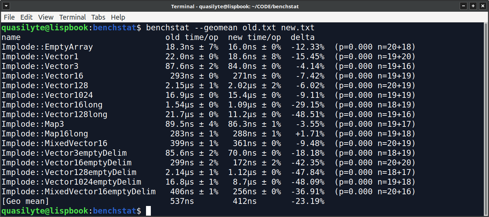
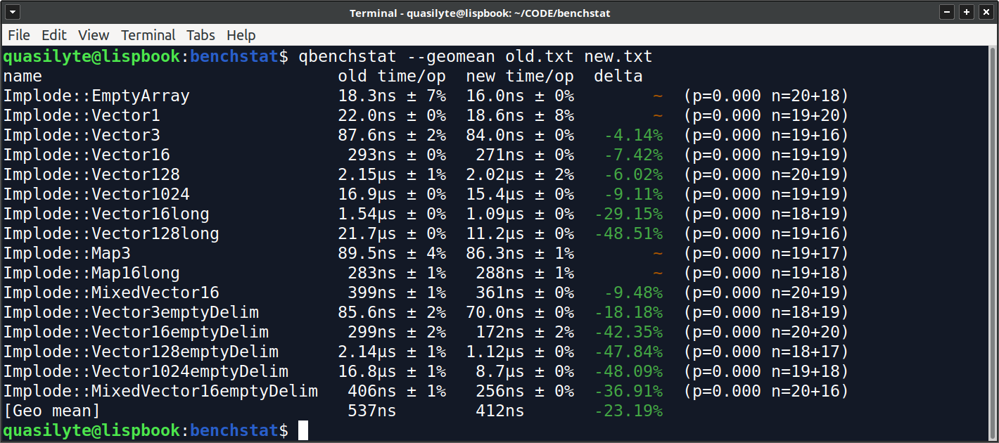

## Overview

My personal, slightly improved version of [benchstat](https://pkg.go.dev/golang.org/x/perf/cmd/benchstat) utility.

## Differences From Benchstat

Lets take two benchmarks data ([old](https://gist.github.com/quasilyte/809f7093de7d60161af150c2a2d3c438) and [new](https://gist.github.com/quasilyte/ee37f1f6dbad06c00deb8bba6dce1a9f)) and compare them using benchstat:



Here is the result from qbenchstat:



The key differences:

* Colored output
* Stricter rules to consider something a significant change

There are other differences too, like fixed geomean for values with zeroes.

## Usage

The usage is identical to the original benchstat, plus some new flags.

```
Usage of ./bin/qbenchstat:
  -alpha α
    	consider change significant if p < α (default 0.05)
  -delta-test test
    	significance test to apply to delta: utest, ttest, or none (default "utest")
  -geomean
    	print the geometric mean of each file
  -no-color
    	disable the colored output
  -sort order
    	sort by order: [-]delta, [-]name, none (default "none")
  -split labels
    	split benchmarks by labels (default "pkg,goos,goarch")
```

The new flags:

* `no-color`

## Installation

```bash
$ go install github.com/quasilyte/qbenchstat/cmd/qbenchstat
```
